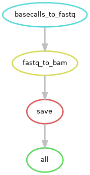
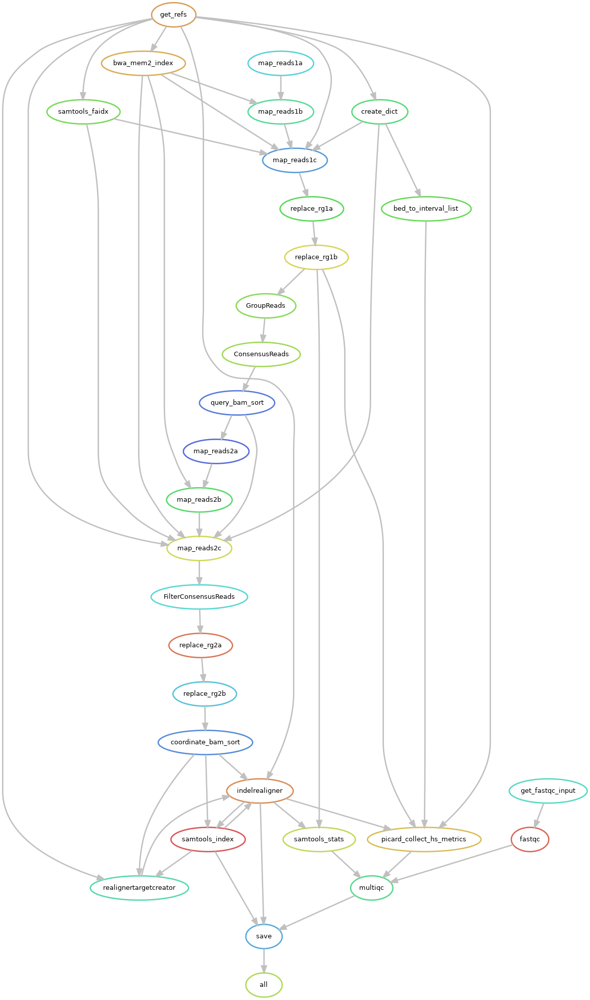
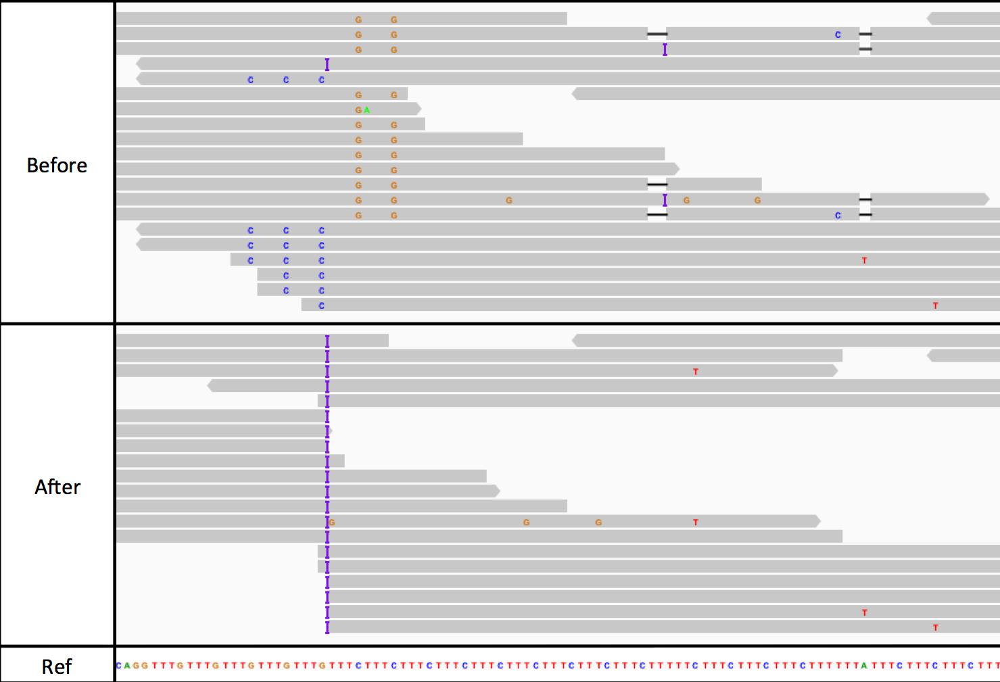
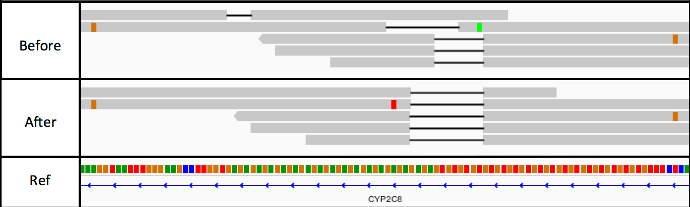
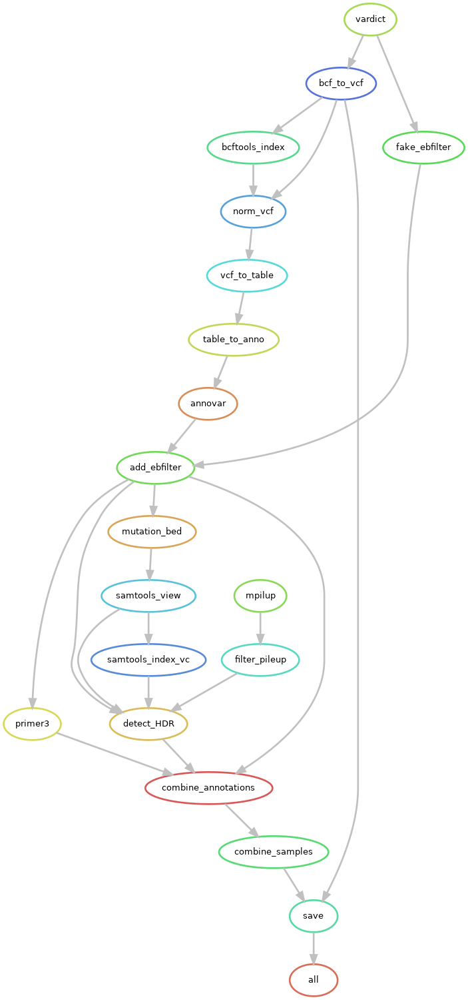
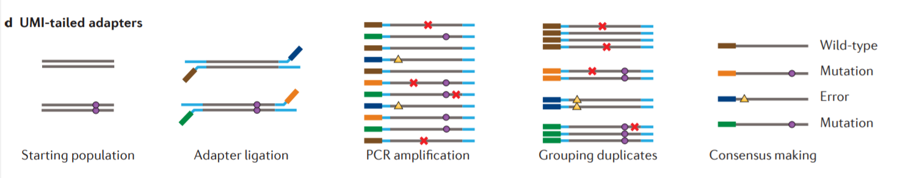

- built by Raphael Hablesreiter & Robert Altwasser
- modified by Hanna Edler

Latest release v2.3, published on Jan 11, 2025

[](https://doi.org/10.5281/zenodo.14632260)

This pipeline was developed to call variants from targeted exome sequencing. It consists of three parts:

1. [Demultiplexing](#Demultiplexing)
2. [Preprocessing](#Preprocessing)
3. [Variant calling](#Variantcalling)

# Installation

This pipeline was developed for use on the [BIH HPC](https://hpc-docs.cubi.bihealth.org) at [Berlin Institute of Health (BIH)](https://www.bihealth.org/en/).

We used the [Miniforge](https://github.com/conda-forge/miniforge) installer for Conda environment installation.

Only Snakemake ([v8.10](https://snakemake.readthedocs.io/en/v8.10.0/)) needs to be installed in a new Conda environment. All other packages needed, get installed by Snakemake automatically when running the pipeline for the first time (`snakemake -p --use-conda --conda-frontend mamba --conda-prefix --workflow-profile=my_profile --jobs --cores`). It is recommended to define a common directory for all Conda environments of this pipeline `--conda-prefix`.

# Configuration files

Configuration files are a [samplesheet.csv](https://github.com/edjoha/umi-processing/blob/main/README.md#samplesheet) and a [config.yaml](https://github.com/edjoha/umi-processing/blob/main/README.md#configfile). Templates can be found here [`templates/`](https://github.com/edjoha/umi-processing/tree/main/templates).

## Samplesheet

To demultiplex Illumina basecalls into different samples, [`bcl2fastq`](https://emea.support.illumina.com/sequencing/sequencing_software/bcl2fastq-conversion-software.html) can be used. It has to be executed in the base directory of the sequencing run (the one with the `RunInfo.xml` in it). A `SampleSheet.csv` has to be created containing the (7') barcode indexes for each sample. If UMIs are present, their length can be given in sample sheet.
For the demultiplexing to run, we need a sample sheet. A template can be downloaded [here](https://sapac.support.illumina.com/downloads/sample-sheet-v2-template.html).

Let's say the *Project Registration* form has the following format:

| Library order number | pool name   | Library  Code/Name | I7_Index_ID | I7_Index          | I5_Index_ID | I5_Index | …   | Remarks |
| -------------------- | ----------- | ------------------ | ----------- | ----------------- | ----------- | -------- | --- | ------- |
| 1                    | P1557_BL_01 | S-BeLOV-248164     | IDT8_i7_1   | CTGATCGTNNNNNNNNN | IDT8_i5_1   | ATATGCGC | …   | Lane 1  |
| 2                    | P1557_BL_01 | S-BeLOV-248536     | IDT8_i7_2   | ACTCTCGANNNNNNNNN | IDT8_i5_2   | TGGTACAG | …   | Lane 2  |

the corresponding sample sheet would look like this:

```
[Header],,,
FileFormatVersion,2,,
MyRunName,P1557,,
InstrumentPlatform,NextSeq6000,,
InstrumentType,NextSeq6000,,
,,,
[Reads],,,
Read1Cycles,148,,
Index1Cycles,17,,
Index2Cycles,8,,
Read2Cycles,148,,
,,,
[Data],,,
Lane,Sample_ID,Sample_Name,index,index2
1,S-BeLOV-248164,S-BeLOV-248164,CTGATCGT,GCGCATAT
2,S-BeLOV-248536,S-BeLOV-248536,ACTCTCGA,CTGTACCA
```

- The information for the [Reads] section can be found in the *project_registration_form* or *RunInfo.xml*
- Please note the *NNNNNNNNN* in the I7_Index are removed
- the *index2*, which holds the I5_Index is ***reverse complement!***. This can be done using [this link](https://arep.med.harvard.edu/labgc/adnan/projects/Utilities/revcomp.html).

## configfile

This file has to give the paths to different annotation files. Especially important are

- general:
    - defines key paths to run the pipeline
    - `control`: Are control samples present? If `True`, `EBFilter` will be performed. (See section [EB filter](#EB filter)). The names of the control samples should be stored in a plain text file. The location of the plain text file should be given as `edit: normals: /Path`.

- reference:
    - paths to the reference genome and annotation files
- readstructure: This has to be adjusted to the run. See below
- region_file: make sure you have the correct target file
- picard-> memoryusage: Adjust for bigger datasets

### Readstructure

The *readstructure* tells the demultiplexer which part of the reads is an adapter, and what is the sequence. Information about this can be found in `RunInfo.txt` and the meta data file with the barcodes. Please note that the first index also contain the UMIs

```
<Read Number="1" NumCycles="148" IsIndexedRead="N"/>
<Read Number="2" NumCycles="17" IsIndexedRead="Y"/>
<Read Number="3" NumCycles="8" IsIndexedRead="Y"/>
<Read Number="4" NumCycles="148" IsIndexedRead="N"/>
```
Means (in `bcl2fastq` syntax):

```
readstructure: "y148,i8y9,i8,y148"
```

- `y148`: 184bp transcript
- `i8`: 8bp barcode sample
- `y9`: 9bp index molecular (UMI)
- also `S`: skip

If you have no information, one can also just convert the entire sequences to fastq without de-multiplexing and without trimming. Note that you need to set the entire read length to template. **148T** in this example. Then you can `grep` the barcodes and stuff.

```
picard  IlluminaBasecallsToFastq B=./{MY_RUN}/Data/Intensities/BaseCalls/ L=1 RS=148T INCLUDE_NON_PF_READS=false COMPRESS_OUTPUTS=false RUN_BARCODE=MY_RUN OUTPUT_PREFIX=MY_RUN READ_NAME_FORMAT=ILLUMINA  NUM_PROCESSORS=1 IGNORE_UNEXPECTED_BARCODES=false FORCE_GC=false
```

# Demultiplexing

This is the structure of the Demultiplexing part of the pipeline:



## Recommendations for ressources:

[Developer´s recommendations for _bcl2fastq_](https://support.illumina.com/content/dam/illumina-support/documents/documentation/software_documentation/bcl2fastq/bcl2fastq2-v2-20-software-guide-15051736-03.pdf)  (`rule basecalls_to_fastq`):

Considerations for Multiple Threads
When using processing options to assign multiple threads, consider the following information:
- The most demanding step is the processing step (-p option). Assign this step the most threads.
- The reading and writing stages are simple and do not need many threads. This consideration is important for a local hard drive. Too many threads cause too many parallel read-write actions and suboptimal performance.
- Use one thread per CPU core plus some extra. This method prevents CPUs from being idle due to a thread being blocked while waiting for another thread.
- The number of threads depends on the data. If you specify more writing threads than samples, the extra threads do no work but cost time due to context switching.

Previous datasets gave an orientation how much `runtime` is needed by `fastq_to_bam` for which file sizes:

runtime = 0.027 + 0.16*(FASTQ.GZ file size), which results in

`runtime=lambda wc, input: max(0.3 * input.size_mb/1000)+ "h"`

# Preprocessing

This is the structure of the Preprocessing part of the pipeline:



1.  **map_reads1a,b,c**: The BAM files are converted to FASTQ, and then the FASTQ files are mapped to the genome. [BWA-MEM2](https://github.com/bwa-mem2/bwa-mem2) is used for alignment.

2.  **replace_rg1a,b**: BWA-MEM2 modifies the bam header in an unexpected way. RG header needs to be replaced.
    
3.  **Group reads**: Sequences are grouped according to their UMI sequence.
    
4.  **Consensus reads**: PCR can introduce errors, which can be indistinguishable from *real* mutations. Therefor, the reads are grouped by their UMIs, and only the consensus sequences are kept. Here, Consensus reads filters all reads that don't appear *at least three times per UMI*.
    
5.  **map_reads2a,b,c**: Consensus sequences mapped to the genome again. [BWA-MEM2](https://github.com/bwa-mem2/bwa-mem2) is used for alignment.

6.  **replace_rg2a,b**: BWA-MEM2 modifies the bam header in an unexpected way. RG header needs to be replaced.
    
7.  **FilterConsensusReads**: Reads can be filtered here according to base quality or consensus error rate.
    
8.  **local realignment**:
    
    - Around known indels, local realignments are performed. Especially towards the end of reads, "mismatch" is cheaper than gap opening, leading to false positives.
    - genome aligners can only consider each read independently
    - local realignment considers all reads spanning a given position
        - parsimonious alignment of reads
     
            
            

## Recommendations for ressources:

Previous datasets gave an orientation how much `runtime` is needed by `map_reads1` (in [v2.1](https://github.com/edjoha/umi-processing/releases/tag/v2.1)) for which file sizes:

runtime = -0.78 + 0.39*(unmapped.bam file size), which results in

`runtime=lambda wc, input: max(0.6 * input.size_mb/1000)+ "h"`

# Variantcalling

This is the structure of the Variant calling part of the pipeline:



## vardict:
    - single (end) mode
    - “ultra sensitive variant caller for [..] variant calling from BAM files”
    - philosophy is to “call everything”, and filter later
    - calls SNV, MNV, InDels, complex and structural variants
    - insertions and deletions often work as tandem
    - if InDel is detected, surrounding area is scanned for more InDels or mismatches
        - combination to one complex variant
    - calling of structural variants with paired end data
    - works with amplicons/targeted sequencing; single end only

## EB filter
    - Empirical Bayesian false positive filtering of somatic mutations in cancer genome sequencing. This is done via:
    - **if you do not have a healthy control, set the value to "False" in the config file**
    - estimating sequencing error model using *control* sequencing data
    - compare mismatch ratio with observed mismatch ratio of tumor samples
    - if the mismatch ratio of the tumor sample significantly deviates from the predicted mismatch ratio, it is probably a highly likely somatic mutation
    - Since we usually don't have healthy control, this should not be done.
    - An alternative is using random tumor samples as background.

## anntoation:
    - ANNOVAR: adds gene/region/variant based annotation [>LINK<](https://annovar.openbioinformatics.org/en/latest/)
        - COSMIC: *Catalogue Of Somatic Mutations In Cancer*
        - dbSNP: known human SNP data base by *NCBI*
        - clinVAR: known mutations in a clinical context
    - HDR: *High Discrepancy Region*; regions with many localized differences

## Filtering of results
    - *TVAF*: portion of reads with variation
        - should have high difference between control and tumor (impurities)
        - VAF == 1: SNP in all cells, almost always germline 
        - VAF == 0.5: SNP on one chromosome; from one parent
        - else: tumor impurities
    - *clinical*: Is the gene of clinical interest?
    - *dbSNP*: Is the variance known?
    - *coverage*: coverage of mutation and normal
    - *EBFilter*: Is the mutation somatic or germline?
    - ...
    - **still a lot of visual verification necessary (IGV)**


# Analyse projects with different target files

If there are different target files for the samples of the analysis, I recommend the following workflow:

1. demultiplex all files together
    - snakemake target `"qc/multiqc.html"`
2. set desired target file in config (`region_file`)
3. only leave samples belonging to this target file in the sample sheet
4. run analysis till variant calling 
    - snakemake target `expand("vardict/{sample}.vcf", sample = SAMPLES)`
5. move/rename file `qc/multiqc.html` since it will be overwritten
6. remove file `refs/region.intervals`!
7. repeat 2-6 with other target file
8. add all samples again to sample sheet
9. run analysis till the end
    - snakemake target `"filter/variantcalls.csv"`

# Glossary

AML
: Acute Myeloid Leukemia

HSC
: hematopoietic stem cell

HSCT
: hematopoietic stem cell transplantation

CDR
: commonly deleted region

VAF
: variant allele frequency

UMI Adapters
: PCR can introduce errors, which can be indistinguishable from *real* mutations. Therefor, every strand of sequenced DNA is marked with a unique molecular identifier (UMI). After PCR amplification, the reads are grouped by their UMIs, and only the consensus sequences are kept.



Clonal hematopoiesis (CH)
: somatic mutation in leukemia-associated genes in the blood of individuals without hematologic disease.

Demultiplexing
: The raw sequencing data is put into (yet) unmapped SAM/BAM files per sample according to the barcodes.

# Troubleshooting

- programs crash without error:
    - usually not enough memory
    - increase `picard` memory in `config.yaml`

- `barcode_metrices.txt` has only "Unmatched" reads
    - indexes in `barcodes_params` wrong

- `barcode_metrices.txt` has **almost** only "unmatched" reads
    - 5' indexes not reverse complement

- `XX.unmapped.bam` files remain empty:
    - indexes in `library_param.csv` and `barcode_params` don't match
    - check `picard` log for `picard.PicardException: Read records with barcode CGCAATCTNNNNNNNNNACAGGCAT, but this barcode was not expected. (Is it referenced in the parameters file?)`
